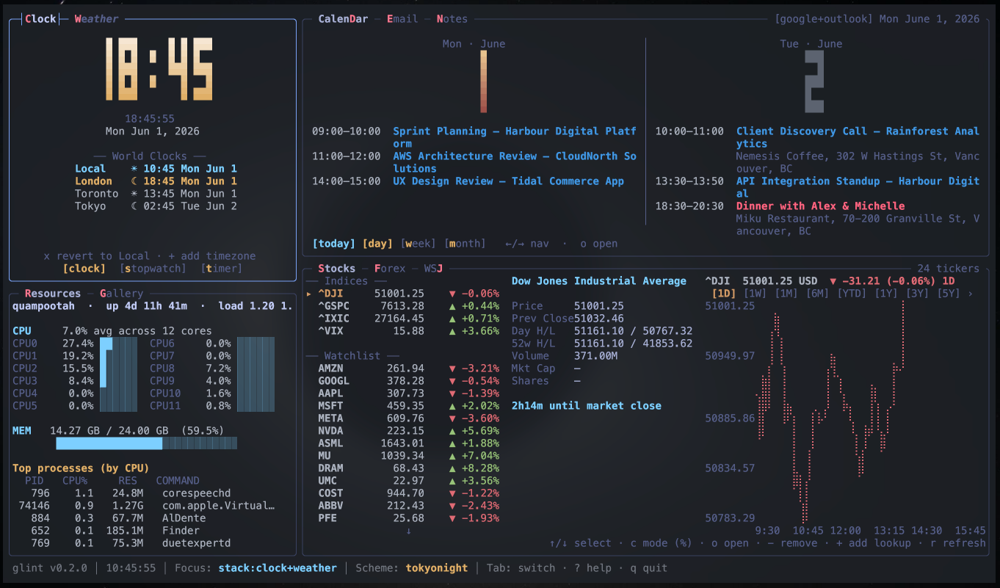
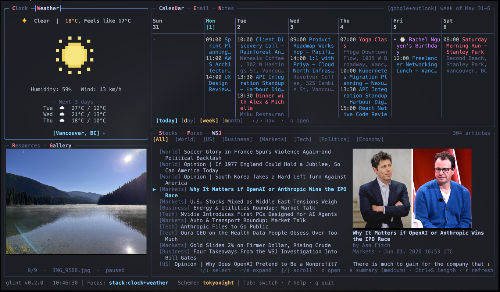
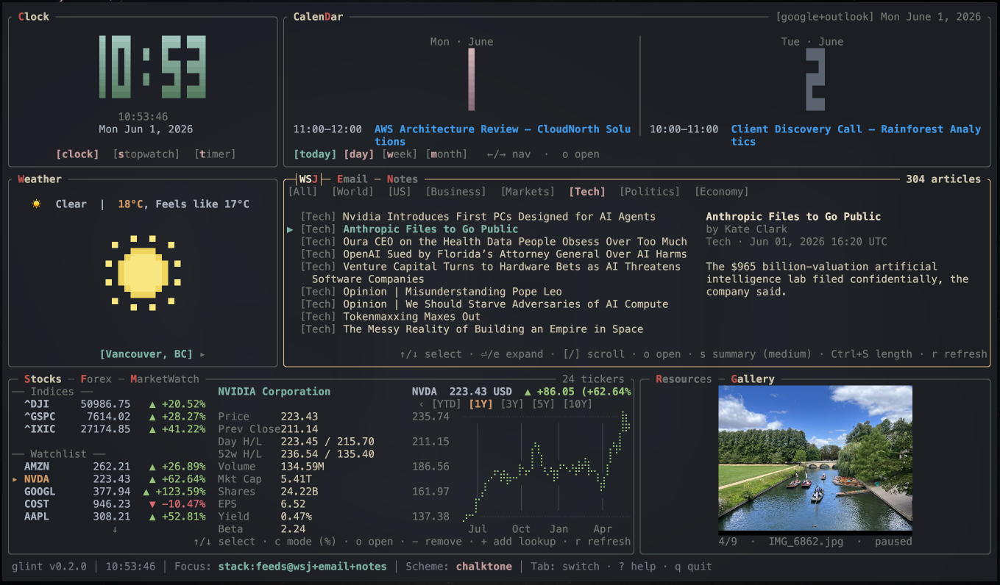

# docket

## Origins

docket is a hard fork of [**glint**](https://github.com/ntrospect0/glint),
a fast, keyboard-driven terminal dashboard written by
[**ntrospect0**](https://github.com/ntrospect0). Every widget engine,
the wizard, the rendering pipeline, the config/cache architecture —
the whole foundation this project stands on — is ntrospect0's design
and work. glint's own goal is to be a general-purpose, highly
adaptable dashboard: whatever mix of stocks, weather, calendar, news,
and more you want, composed your way. That idea, and the care put
into making it genuinely pleasant to use in a terminal, is what made
this fork worth doing in the first place — thank you, ntrospect0.

docket exists because I wanted something narrower and more opinionated:
a dashboard purpose-built around *my* work and project management, not
a general-purpose canvas. That's a different design goal than glint's,
not a better one, so rather than pile my opinions onto glint as
options and flags, I forked it and started shaping it toward that one
purpose. This is a standalone project going forward — it doesn't track
glint's upstream changes, and its own direction will diverge over
time. If you want the general-purpose dashboard, go use glint; it's
great, and this project wouldn't exist without it.

Like glint, docket is licensed GPL-3.0-or-later — see [`LICENSE`](LICENSE).

---

A fast, keyboard-driven terminal dashboard for getting things done.
Calendar, news, email, notes, system resources, and single-source RSS
feeds — all in one grid you compose yourself. Written in Rust with
[ratatui](https://ratatui.rs).

https://github.com/user-attachments/assets/31f79aef-412c-44fb-bd72-c684e6aa9185

*A live capture — keyboard shortcuts driving focus, view changes, and
widget interaction across the dashboard.*



*A composed dashboard — calendar and email on one side, news and a
resources / feeds stack on the other. `tokyonight` scheme.*



*Same layout, different views — calendar in week mode, the feeds
widget scrolling the latest articles in the middle stack.*



*A different layout in the `chalktone` scheme, focused on a
single-source RSS feed.*

Everything is opt-in, locally configured, and persists in plain TOML
under `~/.config/docket/` — no accounts, no telemetry, no cloud
component docket controls. First launch seeds a working default
dashboard directly from TOML — no interactive setup flow to walk
through.

---

## Highlights

- **Six widget kinds**, each independently configurable, with sensible
  built-in defaults — see the [widget catalogue](#widget-catalogue) below.
- **Composable layout**: a grid of cells; any cell can be a single
  widget or a **stack** of widgets you cycle between with `.` / `,`.
- **Multi-instance** — run the same widget kind in several panes
  (`calendar@work` + `calendar@personal`, `feeds@wsj` + `feeds@ai`).
- **Profiles** — `docket --profile work` (or `-p work`) runs an isolated
  config tree: its own layout, widgets, theme, and accounts. Create one
  with `docket --new-profile work`, switch with `--profile work`. The
  colorscheme library is shared; everything else is per-profile. See
  [INSTRUCTIONS.md → Profiles](INSTRUCTIONS.md#profiles).
- **Live config reload** — edit any widget's TOML and the dashboard
  picks it up without a restart.
- **Theming** — nine bundled colour schemes; per-widget colour overrides;
  add your own schemes by editing one TOML file. `:scheme nord` switches
  live.
- **No setup wizard** — `docket --init` (or first launch with no config)
  seeds default TOML files directly; hand-edit them to customize. No
  interactive flow to walk through.
- **Keyboard-first, mouse-friendly** — `Tab` cycles widgets,
  `Shift+<letter>` jumps to a widget by its shortcut letter, `:` opens
  a command bar, click anywhere to focus.
- **Focus Zoom** — press `z` to enlarge the focused widget into a
  centered frame over a dimmed backdrop, then `z` (or `Esc`) to return
  exactly where you were. Given the room, every widget paints a richer
  **Full-tier** view — reading panes, multi-column grids, a
  wall-calendar month with per-day event dots — so a cramped cell
  becomes fully legible without leaving the terminal. Retarget the zoom
  to another widget with `Tab` or `Shift+<letter>` without exiting.
- **No cloud component**: every credential lives on disk under
  `~/.config/docket/credentials/` (0600 perms). API calls go directly
  from your machine to the upstream service.

---

## Install

### From source (only option for now)

You need a recent Rust toolchain (1.81+). Install via
[`rustup`](https://rustup.rs/) if you don't have one.

```sh
git clone https://github.com/nicococo/docket.git docket
cd docket

# Per-user install (no sudo, installs to ~/.local/bin):
make install PREFIX=~/.local

# Or system-wide (typically needs sudo):
sudo make install
```

If `~/.local/bin` isn't on your `$PATH`, add this to `~/.zshrc` or
`~/.bashrc`:

```sh
export PATH="$HOME/.local/bin:$PATH"
```

Verify:

```sh
docket --version
```

### Makefile targets

| target | what it does |
|---|---|
| `make` / `make release` | release build at `target/release/docket` |
| `make build` | debug build (faster compile, slower runtime) |
| `make install` | release build + copy to `$(PREFIX)/bin/docket` |
| `make uninstall` | remove `$(PREFIX)/bin/docket` |
| `make test` | run the test suite |
| `make clean` | `cargo clean` |

### Slim builds

Every widget compiles in only when its feature is enabled. The default
`widgets-all` umbrella turns them all on. For a smaller binary:

```sh
cargo install --path . --no-default-features \
  --features widget-calendar,widget-news
```

Available features: `widget-calendar`, `widget-news`, `widget-email`,
`widget-resources`, `widget-notes`, `widget-feeds`.

### Updating

```sh
git pull
make install PREFIX=~/.local   # or sudo make install
```

### macOS app icon (optional)


docket is a terminal program, but on macOS you can wrap it in a
double-clickable app that opens it in your terminal — handy for the
Dock or Spotlight. The icon assets live in
[`assets/icon/`](assets/icon/) (`docket.png` and `docket.icns`).

With docket on your `$PATH`:

```sh
./assets/icon/install-macos-app.sh
```

This builds `~/Applications/Docket.app` with the icon above, launching
docket in `~`. First open may need a right-click → **Open** (the bundle
isn't code-signed).

The script auto-detects an installed terminal and supports **Kitty,
Ghostty, WezTerm, Alacritty, Rio** (launched directly) and **iTerm2,
Apple Terminal** (via AppleScript). Force one with the `TERMINAL` env
var:

```sh
TERMINAL=alacritty ./assets/icon/install-macos-app.sh
```

Warp, Hyper, and Tabby expose no command to run a program in a new
window, so they aren't supported — add a case to the script if your
terminal isn't listed.

---

## Quickstart

Launch with no existing config and docket seeds sensible defaults
straight to disk, then launches:

```sh
docket
# → "No config detected … writing defaults."
# → "Edit that file (or the per-widget TOMLs alongside it) to customize your dashboard."
```

That writes `~/.config/docket/config.toml` (a two-pane calendar + news
layout) plus a default TOML for every widget kind. From there:

1. Hand-edit `config.toml`'s `[layout]` section to add, remove, or
   rearrange panes — see [Configuration](#configuration) below for the
   full schema and a worked example.
2. Edit the per-widget TOML (`calendar.toml`, `news.toml`, …) for
   things like RSS feeds, calendar providers, or mailbox folders.
3. Fill in credentials where a widget needs them — CalDAV/ICS for
   Calendar, IMAP for Email, an API key for LLM summaries. Templates
   are seeded under `~/.config/docket/credentials/`; no OAuth flow,
   just edit the TOML (see [INSTRUCTIONS.md](INSTRUCTIONS.md) for the
   walkthrough per provider).

`docket --init` re-runs the seeding step at any time — it's idempotent,
so it only writes files that are still missing; existing files and
hand-edits are left untouched.

Press `?` while running for the live keybinding overlay.

---

## Widget catalogue

| widget | what it does | external services |
|---|---|---|
| **Calendar** | day / week / month views with event agenda | CalDAV (iCloud / Fastmail / Nextcloud), ICS/webcal feed (incl. Google Calendar's "secret address"), local TOML events |
| **News** | RSS / Atom aggregator with topic filters, keyword search (`:news <terms>`), optional per-article LLM summaries | any RSS/Atom feed; LLM provider for summaries |
| **Feeds** | tabbed single-source RSS reader (WSJ, MarketWatch, or any feed you point it at), one tab per source | any RSS/Atom feed; LLM provider for summaries |
| **Email** | unified inbox preview with optional per-message LLM summaries | any IMAP server (app password) |
| **Resources** | htop-style CPU / memory / top-process view | local `sysinfo` (no FFI) |
| **Notes** | vim-flavoured multi-note pad with undo/redo, mouse cursor positioning, per-note files | none — plain `.md` files under `~/.config/docket/notes/` |

Every widget is independently optional — turn a kind off entirely with
`--no-default-features` (see [Slim builds](#slim-builds)), or just
leave it out of `[layout]`.

---

## Configuration

All files live under `~/.config/docket/`:

| file | what it controls |
|---|---|
| `config.toml` | active colour scheme, mouse-scroll direction, status bar, grid layout, widget cell placements |
| `colorschemes.toml` | named theme palettes (`default`, `chalktone`, `gruvbox`, `tokyonight`, `rosepine`, `nord`, `bluloco`, `onedark`, `miasma`) |
| `news.toml` | RSS / Atom feeds, topic filters, LLM summary toggle, fetch-body strategy |
| `feeds.toml` (or `feeds@<instance>.toml`) | `[[feeds]]` blocks for one tabbed single-source reader instance |
| `calendar.toml` | CalDAV / ICS / Local providers + per-provider calendar IDs |
| `email.toml` | folders to follow, polling cadence, LLM-summary opt-in |
| `resources.toml` | refresh interval, top-N processes, sort key (CPU vs memory) |
| `notes.toml` | per-widget shortcut + colour overrides (notes themselves live under `notes/`) |
| `llm.toml` | active LLM provider (`anthropic` or `openai`), model, rate limit, cache size |
| `credentials/` | API keys + app passwords (`anthropic_key.toml`, `openai_key.toml`, `caldav.toml`, `ics.toml`, `imap.toml`) — 0600 perms |
| `notes/<instance>/` | one `.md` file per note, `mtime` sorts the list |

Most fields have sensible defaults; you only have to set what you care
about. Hand-edit any file and `:reload` (or just save — the config
watcher picks it up automatically).

### Layout example

```toml
# config.toml
version = 1

[global]
theme = "nord"
mouse_scroll = "natural"
show_status_bar = true

[layout]
columns = [28, 36, 36]    # three columns at 28% / 36% / 36% of width
rows = [30, 35, 35]       # three rows at 30% / 35% / 35% of height

[[layout.cells]]
widget = "calendar"
col = 0
row = 0

[[layout.cells]]
widget = "email"
col = 1
row = 0
col_span = 2              # span two columns

# Stack pane: three widgets share row 1, cols 1–2; rotate with . / ,
[[layout.cells]]
widgets = ["news", "feeds", "notes"]
col = 1
row = 1
col_span = 2

[[layout.cells]]
widget = "resources"
col = 0
row = 2
col_span = 2
```

### Multi-instance widgets

Cells can reference a widget as `kind@instance`:

```toml
[[layout.cells]]
widget = "feeds@wsj"
col = 0
row = 2

[[layout.cells]]
widget = "feeds@marketwatch"
col = 1
row = 2
```

The first reads `feeds@wsj.toml`, the second `feeds@marketwatch.toml` —
each instance is fully independent. Same trick works for calendars
(work + personal), email (two accounts), etc. A bare `widget = "feeds"`
(no `@instance`) reads the implicit `main` instance's `feeds.toml`.

### Per-widget colour overrides

Any widget's TOML can carry a `[colors]` block that overrides the
active theme just for that widget:

```toml
# calendar.toml
poll_interval_secs = 60

[colors]
border.focused = { fg = "#e07b00", modifiers = ["bold"] }
widget_title.focused = { fg = "#fff", bg = "#e07b00", modifiers = ["bold"] }
```

Same field shape as `colorschemes.toml`.

### Adding a custom colour scheme

```toml
# colorschemes.toml
[schemes.my_scheme]
border.focused           = { fg = "#88c0d0", modifiers = ["bold"] }
border.unfocused         = "#3b4252"
widget_title.focused     = { fg = "#000", bg = "#88c0d0", modifiers = ["bold"] }
widget_title.unfocused   = { fg = "#eceff4", modifiers = ["bold"] }
metadata.focused         = { fg = "#d8dee9" }
metadata.unfocused       = { fg = "#616e88", modifiers = ["dim"] }
text.plain               = { fg = "#d8dee9" }
text.brilliant           = { fg = "#eceff4", modifiers = ["bold"] }
text.dim                 = { fg = "#616e88" }
text.selected            = { fg = "#ebcb8b", modifiers = ["bold"] }
text.focused             = { fg = "#88c0d0", modifiers = ["bold"] }
text.shortcut            = { fg = "#bf616a", modifiers = ["bold"] }
```

Then `:scheme my_scheme` (persisted to `[global] theme`).

> ⚠️ Dotted keys must be **unquoted** (`border.focused`, not
> `"border.focused"`). Quoted dotted keys silently fail to deserialize.

---

## Keybindings

### Global

| key | action |
|---|---|
| `Tab` / `Shift+Tab` | cycle focused widget |
| `Shift+<letter>` | jump focus to a widget by its shortcut letter (lit in title) |
| `click cell` | focus that widget |
| `z` / `Shift+Z` | zoom the focused widget in / out (Focus Zoom) |
| `Esc` | exit zoom — a first `Esc` clears the widget's own mode (e.g. Notes insert), a second exits |
| `.` / `,` | rotate the active widget in a stack pane |
| `:` | open the command bar |
| `?` | toggle help overlay (scrollable) |
| `q` / `Ctrl+C` | quit |

While zoomed, `Tab` / `Shift+Tab` and `Shift+<letter>` **retarget** the
zoom to another widget instead of moving focus; clicking a dimmed
backdrop widget retargets to it, and clicking the empty margin exits.
State (selection, scroll, active tab, warm data) is preserved entering
*and* leaving zoom — it's a resize, not a reset.

### Command bar (`:`)

| command | what it does |
|---|---|
| `:scheme <name>` | switch colour scheme (persists to `config.toml`) |
| `:reload` | re-read every widget's TOML without restarting |
| `:news <terms>` | filter News by keyword |
| `:feeds <terms>` | filter the active Feeds instance by keyword |

### Common per-widget keys

| widget | keys |
|---|---|
| **Calendar** | `d` / `w` / `m` day/week/month · `h` / `l` prev/next period · `←↑↓→` move the selected day (month view) · `j` / `k` scroll the day agenda · `t` today · `g` cycle digit gradient · click a day to select it |
| **News** | `↑/↓` select · `←/→` filter tabs · `e` expand · `s` LLM summary · `Enter` open · `x` clear search |
| **Feeds** | `↑/↓` select article · `←/→` switch topic tab · `e`/`Enter` expand · `o` open in browser · `s` LLM summary · `Ctrl+S` cycle summary length · `r` force refresh · `x` clear search |
| **Email** | `↑/↓` select · `←/→` folder · `e`/`Enter` expand · `o` open in mail client · `s` LLM summary · `u` mark read/unread · `r` refresh |
| **Resources** | `m` toggle sort (CPU ↔ memory) · `r` force refresh |
| **Notes** | `+` new · `-` delete (confirm) · `i` insert · `ESC` normal · `h`/`l` focus list / content · `j`/`k` scroll · `gg`/`G` top/bottom · `y` yank note · `Ctrl-A`/`Ctrl-E` line start/end · `Ctrl-U` delete line · `Ctrl-Z` / `Ctrl-Shift-Z` undo / redo |

Hit `?` while running for the full overlay with the current shortcut
assignments and active scheme.

---

## CLI reference

```sh
docket                    # launch the dashboard (seeds defaults first, on first run)
docket --init             # create/refresh ~/.config/docket/ with default seed files
docket --new-profile <name> [--from <src>]
                         # create a profile, optionally cloning another's config
docket --profile <name>   # (or -p) run under an isolated profile
docket --list-profiles
docket --rename-profile OLD:NEW
docket --delete-profile <name>
docket --clear-cache [TARGET]
                         # wipe ~/.cache/docket/ entirely, or scope to
                         # a widget kind (news) or instance (news@home)
docket --config <FILE>    # override the default XDG location
docket --version
```

---

## External dependencies

docket pulls every piece of remote data directly from the upstream
service; nothing routes through a docket-owned backend.

| service | used by | auth |
|---|---|---|
| any CalDAV server | Calendar (iCloud, Fastmail, Nextcloud, …) | app password |
| any ICS/webcal feed | Calendar (incl. Google Calendar's "secret address" export) | none, or a secret URL |
| any IMAP server | Email | app password |
| [Anthropic](https://www.anthropic.com/) / [OpenAI](https://openai.com/) | News + Feeds + Email LLM summaries | API key, optional |
| any RSS / Atom feed | News, Feeds | none |

No OAuth anywhere — every credential above is a plain TOML value you
fill in by hand under `~/.config/docket/credentials/`. `INSTRUCTIONS.md`
in the repo has the full step-by-step for CalDAV, ICS, and IMAP setup.

### Rust crate dependencies

Notable runtime crates: `ratatui` (TUI), `crossterm` (terminal I/O),
`tokio` (async runtime), `reqwest` (HTTP), `serde` + `toml` (config),
`chrono` + `chrono-tz` (time / timezones), `feed-rs` (RSS / Atom),
`image` + `ratatui-image` (Feeds article images), `imap` +
`mail-parser` (Email), `sysinfo` (Resources), `readability` (article
extraction for LLM summaries). Full list in `Cargo.toml`.

---

## Data, privacy, and where things live

| where | what |
|---|---|
| `~/.config/docket/*.toml` | your config — fully owned and editable by you |
| `~/.config/docket/credentials/` (0600) | API keys, IMAP/CalDAV app passwords |
| `~/.config/docket/notes/` | notes as plain `.md` files |
| `~/.cache/docket/` | per-widget on-disk caches (news articles, calendar events, email messages, etc.) — regenerable; a startup sweep drops anything > 30 days old |
| `~/.config/docket/docket.log` | runtime log; `tail -f` it to debug |

docket never sends data to any third party that isn't named in the
External dependencies table above. There is no telemetry.

### Credential storage — what it does and doesn't protect

Today every credential docket stores (IMAP / CalDAV app passwords, LLM
API keys) lives in a TOML file under
`~/.config/docket/credentials/` with `0600` permissions and an atomic
write. This mirrors the convention used by `aws`, `gcloud`, `gh`,
`docker`, `npm`, `ssh`, and similar local-first CLIs.

What that covers:

- ✅ Another non-root user on the same Unix host can't read the file.
- ✅ With full-disk encryption on (FileVault / LUKS / BitLocker) a
  lost laptop's offline disk is unreadable until unlocked.
- ✅ App passwords (IMAP, CalDAV) are revocable from the provider's
  account dashboard, and don't grant master-account access.

What it doesn't cover:

- ❌ Anything running as **your** user (a rogue shell script, a
  compromised npm package, anything else with read access to your
  `$HOME`) can read the file. Same threat model as `~/.aws/credentials`
  or `~/.ssh/`.
- ❌ Root / sudo on the host can read the file.
- ❌ Backups that include `~/.config/` (Time Machine, restic, borg,
  Arq, dotfile syncers like chezmoi / yadm / GNU stow) will carry the
  credentials along. Excluding `~/.config/docket/credentials/` is
  recommended; on dotfile managers add it to the per-host ignore
  list rather than syncing it across machines.

Recommended posture:

1. Keep full-disk encryption on.
2. Exclude `~/.config/docket/credentials/` from your backup tool.
3. Exclude it from any dotfile sync — credentials should stay
   per-host.
4. Prefer app passwords (which docket already does) over master
   passwords.

**Coming post-v0.2**: a tiered credential backend (OS keychain →
host-bound encryption → plaintext fallback) selected via
`credentials_backend` in `config.toml`. See `CHANGELOG.md` →
Deferred for the scope.

---

## Troubleshooting

- **`docket` not found after install** — make sure `$(PREFIX)/bin` is on
  your `$PATH`. The Makefile prints the right export line at the end of
  `make install`.
- **Feeds article images look chunky / pixelated** — your terminal
  doesn't speak iTerm2 / Kitty / Sixel inline protocols, so docket fell
  back to unicode half-blocks. Switch to iTerm2 (macOS), WezTerm,
  Kitty, or enable sixel mode in your terminal.
- **A layout cell shows nothing / logs "unknown widget kind in layout,
  skipping"** — the `[[layout.cells]]` entry references a widget kind
  that isn't compiled in (e.g. a slim build) or no longer exists. Fix
  the `widget = "..."` value in `config.toml`.
- **Logs**: runtime alt-screen mode means stderr/stdout would corrupt
  the display, so warnings/errors land in
  `~/.config/docket/docket.log`. `tail -f ~/.config/docket/docket.log`
  while debugging.
- **Reset to defaults**: move aside `~/.config/docket/` and re-run
  `docket --init`.

---

## Contributing

docket is a young fork; the architecture is settling but the surface
is largely stable. If you want to dig in:

1. `make test` — runs the full suite (~540 tests). Should pass clean
   on `main` at all times.
2. `make build` for a debug binary, `make` for release.
3. `cargo clippy --features widgets-all` for lints; CI gates on this.
4. **Adding a widget** is purely additive: implement the `Widget`
   trait under `src/widgets/<name>/`, declare a `widget-<name>` Cargo
   feature, and append a `WidgetDescriptor` to
   `src/widgets/registry.rs`. The registry is the single registration
   point — no edits to `app.rs` or `main.rs` are needed.
5. `AGENTS.md` carries the architecture overview (read it before
   non-trivial PRs). `docs/widget-sdk.md` is the widget author's
   guide — platform capabilities, conventions, and reference
   patterns extracted from the shipped widgets.

Issues and PRs welcome.

---

## License

docket is licensed under **GNU GPL v3 or later** — see
[LICENSE](LICENSE) for the full text. In short: you're free to use,
modify, and redistribute docket, but any modified version you
distribute must also be GPL-licensed and must keep docket's
copyright notices intact. The author retains the right to offer
the project under additional licenses (see
[CONTRIBUTING.md](CONTRIBUTING.md) for the contributor sign-off +
relicensing grant).
