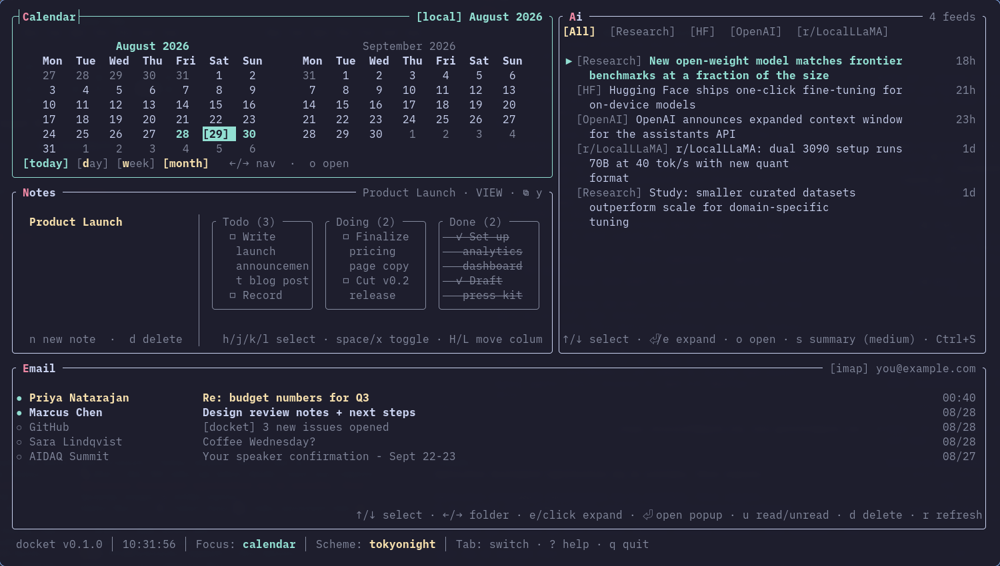

# docket

A fast, keyboard-driven terminal dashboard that pulls your calendar,
email, and notes into one place, distills them with AI, and moves
information between them — an email's action items become a Notes
board card or a Calendar event with one keystroke, not a copy-paste
detour. Written in Rust with [ratatui](https://ratatui.rs).



No accounts, no telemetry, no OAuth. Everything is plain TOML under
`~/.config/docket/` — hand-edit it, back it up, sync it with dotfiles,
whatever you'd do with any other config.

```sh
git clone https://github.com/nicococo/docket.git && cd docket
make install PREFIX=~/.local   # or: sudo make install
docket                          # first run seeds a working default layout
```

---

## Highlights

- **Distill, then move it where it's useful** — `Enter` on an email
  pops the full message with one-key AI summarize / explain /
  extract. Extracted todos and dates are selectable — `space` adds
  them straight to Notes or Calendar. No copy-paste detour.
- **Notes with a kanban board** — the natural landing spot for those
  todos. Any note toggles (`t`) between plain markdown and a
  colourful board view, columns from `## Heading` lines, cards from
  `- [ ]` items — still just a `.md` file underneath.
- **Calendar** — day/week/month agenda over CalDAV, ICS, or local
  events, so the dates you pull out of an email land somewhere
  you'll actually see them again.
- **No wizard, no cloud** — `docket --init` seeds default TOML
  directly; hand-edit credentials under `credentials/` (0600 perms).
  No accounts, no telemetry, no OAuth, nothing phones home beyond the
  provider you point a widget at yourself.
- **Configurable, not the point** — live TOML reload, a composable
  grid, nine colour schemes, Focus Zoom (`z`). All there when you want
  to shape it, none of it what docket is actually for.

---

## Install

Requires Rust 1.81+ via [`rustup`](https://rustup.rs/).

```sh
git clone https://github.com/nicococo/docket.git docket && cd docket
make install PREFIX=~/.local    # per-user, no sudo
# or: sudo make install         # system-wide
export PATH="$HOME/.local/bin:$PATH"   # if not already on $PATH
docket --version
```

| target | what it does |
|---|---|
| `make` / `make release` | release build at `target/release/docket` |
| `make install` | release build + copy to `$(PREFIX)/bin/docket` |
| `make test` | run the test suite |
| `make uninstall` / `make clean` | remove the binary / `cargo clean` |

**Slim builds** — every widget is its own Cargo feature; the default
`widgets-all` turns them all on:

```sh
cargo install --path . --no-default-features --features widget-calendar,widget-news
```

Available: `widget-calendar`, `widget-news`, `widget-feeds`,
`widget-email`, `widget-notes`, `widget-resources`.

**Updating**: `git pull && make install PREFIX=~/.local`.

**macOS**: `./assets/icon/install-macos-app.sh` wraps docket in a
double-clickable `~/Applications/Docket.app` (auto-detects your
terminal; force one with `TERMINAL=alacritty …`).

---

## Quickstart

First launch writes `~/.config/docket/config.toml` (a starter
calendar + AI news + notes + email layout) plus a default TOML per
widget kind. From there:

1. Hand-edit `config.toml`'s `[layout]` to add/remove/rearrange panes.
2. Edit each widget's own TOML (`calendar.toml`, `news.toml`, …) for
   feeds, providers, folders.
3. Fill in credentials where needed — templates are seeded under
   `credentials/`; no OAuth, just TOML. See
   [INSTRUCTIONS.md](INSTRUCTIONS.md) for the walkthrough per provider.

`docket --init` re-runs the seeding step any time (idempotent — only
fills in what's missing). Press `?` while running for the full
keybinding overlay.

---

## Configuration

Everything lives under `~/.config/docket/`:

| file | what it controls |
|---|---|
| `config.toml` | theme, mouse-scroll direction, grid layout + cell placements |
| `colorschemes.toml` | theme palettes (`default`, `gruvbox`, `nord`, `tokyonight`, …) |
| `calendar.toml` / `email.toml` / `news.toml` / `feeds.toml` / `notes.toml` / `resources.toml` | per-widget settings |
| `llm.toml` | active LLM provider, model, rate limit |
| `credentials/` | API keys + app passwords, 0600 perms |
| `notes/<instance>/` | one `.md` file per note |

Hand-edit anything — the config watcher picks up changes live, no
`:reload` needed. Any widget's TOML can also carry a `[colors]` block
to override the active theme just for that widget:

```toml
# calendar.toml
[colors]
border.focused = { fg = "#e07b00", modifiers = ["bold"] }
```

> ⚠️ Dotted keys must be **unquoted** — `border.focused`, not `"border.focused"`.

---

## Keybindings

| key | action |
|---|---|
| `Tab` / `Shift+Tab` | cycle focused widget |
| `Shift+<letter>` | jump to a widget by its shortcut letter |
| `z` / `Esc` | zoom the focused widget in / out |
| `.` / `,` | rotate the active widget in a stack pane |
| `:` | command bar (`:scheme <name>`, `:reload`, `:news <terms>`) |
| `?` | full keybinding overlay (per-widget keys included) |
| `q` / `Ctrl+C` | quit |

Every widget has its own keys on top of these — press `?` any time to
see them for whatever's focused.

---

## CLI reference

```sh
docket                     # launch (seeds defaults on first run)
docket --init               # create/refresh ~/.config/docket/
docket --clear-cache [TARGET]   # wipe ~/.cache/docket/, or scope to a widget/instance
docket --config <FILE>      # override the default config location
docket --version
```

---

## Data & privacy

| where | what |
|---|---|
| `~/.config/docket/*.toml` | your config |
| `~/.config/docket/credentials/` (0600) | API keys, app passwords |
| `~/.config/docket/notes/` | notes as plain `.md` |
| `~/.cache/docket/` | regenerable caches; swept after 30 days |
| `~/.config/docket/docket.log` | runtime log |

docket never sends data anywhere except the provider you point a
widget at yourself (a CalDAV server, an IMAP host, an LLM API) — no
telemetry, no OAuth, no docket-owned backend. See
[INSTRUCTIONS.md](INSTRUCTIONS.md) for exactly what each provider
needs.

Credentials are plain TOML, 0600, atomic writes — same convention as
`aws`/`gcloud`/`gh`/`ssh`. That protects against other local users and
offline disk theft, not against anything running as *your* user or a
backup tool sweeping `~/.config/`. Exclude `credentials/` from backups
if that matters to you, and prefer app passwords over master passwords.

---

## Troubleshooting

- **`docket` not found** — make sure `$(PREFIX)/bin` is on `$PATH`.
- **Feed images look chunky** — your terminal doesn't speak iTerm2 /
  Kitty / Sixel graphics; docket falls back to unicode half-blocks.
- **A layout cell is empty / logs "unknown widget kind"** — that
  widget isn't compiled in (slim build) or doesn't exist.
- **Logs**: `tail -f ~/.config/docket/docket.log`.
- **Reset**: move aside `~/.config/docket/` and re-run `docket --init`.

---

## Contributing

`make test` should pass clean on `main`. Adding a widget is purely
additive — implement `Widget` under `src/widgets/<name>/`, declare a
`widget-<name>` feature, register it in `src/widgets/registry.rs`. See
[CONTRIBUTING.md](CONTRIBUTING.md) and [AGENTS.md](AGENTS.md) for the
full picture. Issues and PRs welcome.

---

## Origins

docket is a hard fork of [**glint**](https://github.com/ntrospect0/glint),
a fast, keyboard-driven terminal dashboard written by
[**ntrospect0**](https://github.com/ntrospect0). Every widget engine,
the rendering pipeline, the config/cache architecture — the whole
foundation this project stands on — is ntrospect0's design and work.
glint's own goal is to be a general-purpose, highly adaptable
dashboard: whatever mix of stocks, weather, calendar, news, and more
you want, composed your way. That idea, and the care put into making
it genuinely pleasant to use in a terminal, is what made this fork
worth doing in the first place — thank you, ntrospect0.

docket exists because I wanted something narrower and more
opinionated: not a general-purpose canvas of widgets you configure,
but a dashboard purpose-built around pulling my own information
sources together, distilling them, and moving what matters between
them with as little friction as possible. That's a different design
goal than glint's, not a better one, so rather than pile my opinions
onto glint as options and flags, I forked it and started shaping it
toward that one purpose. This is a standalone project going forward —
it doesn't track glint's upstream changes, and its own direction will
keep diverging further this way over time. If you want the
general-purpose dashboard, go use glint; it's great, and this project
wouldn't exist without it.

## License

GNU GPL v3 or later — see [LICENSE](LICENSE). You're free to use,
modify, and redistribute docket; any modified version you distribute
must stay GPL-licensed with copyright notices intact. See
[CONTRIBUTING.md](CONTRIBUTING.md) for the contributor sign-off.
